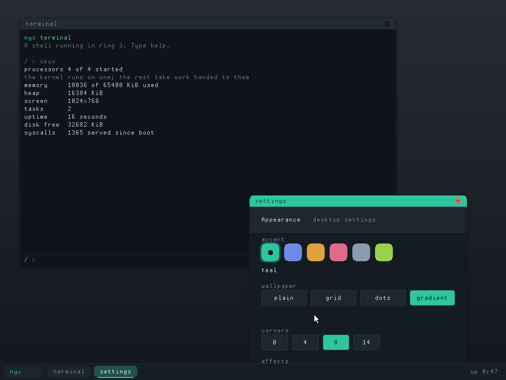

# nyx

A small operating system written from scratch for 32-bit x86. It boots itself
off a disc or a USB stick, drives a framebuffer, manages its own memory,
preempts its own tasks, starts the machine's other processors, keeps files in
directories on a FAT16 disk, talks to the internet, and runs a desktop whose
programs are real ring 3 processes.

It is not a clone of anything. About 12,300 lines of C and assembly, no libc,
no runtime dependencies, and nothing borrowed from another kernel: every
driver, the filesystem, the bootloader, the image writer and the font are
written here, from the specifications where there is one and from scratch
where there is not.

The one exception, since "from scratch" invites the question: `nyx.exe`, the
Windows launcher, is a C# program that bundles the .NET runtime, which is
most of its 162 MB. The kernel inside it is about 700 KB. Nothing third party
runs on the machine nyx boots.

## running it on Windows

Download **nyx.exe** from the
[latest release](https://github.com/blavese/nyx/releases/latest) and run it.
The kernel is inside that file; nothing needs to be built.

The launcher checks for QEMU, the emulator nyx boots on, and offers to install
it from Microsoft's package manager if it is missing. Then press Start and a
black window opens with the operating system running in it. Type `guide` when
you get there.

It runs as a normal user, needs no administrator rights, and cannot affect
Windows: the kernel only ever sees the pretend machine QEMU gives it. Your
files live in a disk image under `%LocalAppData%\nyx`.

Something to try once it boots:

    desktop

A terminal opens. Click the wallpaper, or the badge in the corner, for the
launcher: paint, settings, and what the machine is made of. Drag a title bar
to move a window, click one to bring it forward, Escape returns to the shell.

Everything on that desktop except the system info window is a separate
program running in ring 3. Settings cannot reach into the window manager at
all; it writes a file, and the window manager reads it, which is why the
desktop changes colour while the settings window is still open.

    mkdir docs
    cd docs
    write notes.txt hello
    cat notes.txt

    dhcp
    fetch example.com / page.html
    cat page.html

That gets an address from the network, downloads a live web page over TCP, and
saves it to a disk that survives closing the window.

## running it on a real machine

Download **nyx.iso**, write it to a USB stick or burn it to a disc, and boot
from it. The same file works both ways: a BIOS booting from a disc reads the
El Torito record, one booting from a stick reads the partition table, and both
end up in the same bootloader.

That bootloader is `bootloader/cdboot.S` and it is ours. Nothing else is
involved: no GRUB, no syslinux, no isohybrid. It turns on the A20 gate, asks
the firmware what memory exists, reads the kernel off the boot device and
copies it above 1 MiB through unreal mode, then hands over the way a multiboot
loader is supposed to.

It runs entirely from the disc and writes nothing unless there is a hard disk
attached, in which case it will use it. **Be careful with that on a machine
whose disk you care about**: a blank or unformatted one gets formatted on
first boot.

## running it from source

You need QEMU and Zig. Zig is used only as a cross compiler, so there is no
i686-elf toolchain to build first.

    ./run.sh          boot in a window
    ./run.sh -t       boot headless, console on stdout
    ./run.sh -T       run the built-in self test, exit code is the result
    ./run.sh -i       build a bootable image and boot it through our own
                      bootloader, the way a real machine would

`run.sh` creates a disk image and attaches a network card automatically. The
first three hand the kernel to QEMU with `-kernel`, which means QEMU is doing
the bootloader's job; `-i` is the one that does not.

    python tools/mkiso.py       write build/nyx.iso
    bash tools/iso_test.sh      boot it as a disc and as a stick
    bash tools/shell_test.sh    type at the shell over the serial line
    python tools/shotcheck.py   use the desktop and look at the screen

The Windows launcher lives in `launcher/` and is built with
`dotnet publish -c Release -r win-x64 --self-contained true -p:PublishSingleFile=true`.
It embeds `build/nyx.elf` and a starter disk, so build the kernel and run
`userland/build.sh` first.

## what it actually does

**Boot.** A multiboot header gets it loaded at 1 MiB in 32-bit protected mode.
`bootloader/cdboot.S` is what puts it there on a real machine: the BIOS drops
it at 0x7C00 in 16-bit real mode, and it opens the A20 gate, asks the firmware
for the memory map, reads the kernel off the boot device in 32 KiB chunks and
copies each one above 1 MiB through unreal mode, which is the only way to
write there without giving up the BIOS calls it still needs. It handles both
sector sizes, because a disc reports 2048 bytes and a stick reports 512, and
INT 13h counts in whatever the device uses.
The bootloader's memory map is read to find out how much RAM exists.

**Descriptor tables.** A flat GDT (kernel and user code/data) plus a TSS, which
is how an interrupt taken in ring 3 finds a kernel stack to switch to. A 256-entry IDT with
stubs for all 32 CPU exceptions and 16 hardware IRQs, generated rather than
hand-written.

**Interrupts.** The 8259 PICs are remapped off the exception vectors to 32..47.
Exceptions that nothing handles print a register dump and halt, instead of
silently triple faulting.

**Physical memory.** A bitmap allocator, one bit per 4 KiB frame, built from
the firmware memory map. The kernel image and the bitmap itself are marked in
use so they can never be handed out.

**Virtual memory.** Two-level paging. The low 16 MiB is identity mapped so that
enabling paging does not move the ground out from under the kernel, and
map_page / unmap_page / virt_to_phys work for anything above that. Page faults
report the faulting address and whether it was a read or a write.

**Heap.** First-fit free list with boundary tags, coalescing neighbours on
free. kmalloc, kcalloc, kfree.

**Tasks.** Round-robin preemptive multitasking. Each task owns a kernel stack
holding a complete interrupt frame, so switching is a matter of telling the
interrupt return path to unwind a different one. Tasks sleep, yield and exit,
and dead ones are reaped.

**Disk.** Two drivers behind one block layer. AHCI is tried first, because it
is what a real machine and every modern virtual machine present: the driver
builds a command list and a scatter-gather table in memory and lets the
controller do the transfer itself. If there is no AHCI controller it falls back
to ATA PIO on the primary bus, which moves every word through the CPU and needs
no bus mastering setup. Whichever answers, the rest of the kernel sees the same
four calls.

**Filesystem.** FAT16, so the disk is not a sealed box: other tools can open
the image and files move in both directions. Files are worked on in memory and
written through on every change. Writes are ordered so that losing power part
way through cannot destroy what was already there: the new cluster chain is
written and flushed first, the directory entry is committed as a single sector,
and only then is the old chain released. Anything an interruption stranded is
found and reclaimed at the next mount. A blank disk is formatted automatically
on first boot. `tools/readfat.py` parses the image straight from the
specification, sharing no code with the kernel, and can copy a file in from the
host.

**Network.** PCI enumeration to find the card, then one of two drivers behind
a common interface. The Intel e1000 is tried first, since it is what VirtualBox
and VMware present by default; it is driven through memory-mapped registers and
descriptor rings the card DMAs into by itself. A Realtek RTL8139 driver covers
the other common case with a circular receive buffer and four transmit
descriptors. On top of either: ethernet, ARP with a cache, IPv4 with checksums,
ICMP (it answers pings and sends them), UDP, a DHCP client, a DNS resolver, and
a single-connection TCP client with a three way handshake, orderly close, and
retransmission with exponential backoff. `fetch` uses all of it to do an
HTTP GET.

**The font.** Ninety-five glyphs on an 8 by 16 cell, drawn by hand in
`tools/genfont.py` as pictures made of dots and hashes, which is also how they
are edited. It used to be traced from a system typeface, which made the shapes
somebody else's and put an imaging library in the way of building a font.
Capitals are nine rows, x-height is six, stems are one pixel, and the whole
thing is emitted twice: once as a C array for the kernel and once as a header,
because ring 3 cannot link against the kernel's copy.

**Graphics.** Mode setting through the Bochs VBE dispatch ports rather than a
BIOS call, so it works from protected mode with no real mode trampoline and no
help from the bootloader. The aperture is found through the VGA device's PCI
BAR and mapped explicitly. Drawing goes to a back buffer and is pushed to the
card in one go, because compositing directly in video memory over PCI is
visibly slow. The console is redrawn on top of that with a bitmap font, so
everything that already printed kept working.

**Other processors.** A PC boots with one CPU running and does not say the
others exist, so `acpi.c` goes and reads the firmware tables to find them and
`smp.c` starts each one with an INIT signal followed by a startup signal
carrying a page number. It begins executing there in real mode with no stack
and no paging, which is what `bootloader/trampoline.S` is for. What they do
afterwards is a decision rather than a requirement: sharing the scheduler
would mean a lock on the heap, the task list, the filesystem and every driver,
so instead each one waits for a function to be handed to it. The boot
processor still owns the kernel; the others own nothing until they are given
something.

**Programs.** Ring 3, its own address space per process, and thirty-one system
calls through int 0x80. An ELF32 loader maps each PT_LOAD segment where the
file asks and refuses anything that would land in kernel memory. `userland/`
holds programs built entirely separately: the only thing they share with the
kernel is the syscall numbers. They are then pasted whole into the kernel
image, so a fresh install already has something to run. They are deliberately
never saved to the disk: if they were, the first boot would write them out and
every later boot would run the written copies, so rebuilding the kernel would
appear to change nothing.

**Windows.** A compositing window manager: windows are off-screen surfaces,
the manager owns the chrome, the stacking order and the pointer, and the whole
screen is assembled into the back buffer and pushed once per frame so a window
moving over another leaves no trail. Title bars drag, clicking raises, the
close box closes, and a taskbar shows what is open.

**The window server.** A program in ring 3 cannot touch the framebuffer and
cannot be handed a kernel pointer, so a window's pixels are allocated on a page
boundary and mapped into the calling process with the user bit set. The program
draws into that memory directly and asks for a repaint; the kernel keeps the
window and hands back only a small integer handle, checked against the caller
on every call. Input travels the other way through a per-window event queue.
`paint` is an ordinary ELF executable that uses nothing else: sixteen colours,
four brush sizes, and strokes interpolated with Bresenham, because the mouse
reports in jumps and without it a quick stroke is a row of dots.

**Drivers.** Framebuffer and VGA text consoles, PS/2 keyboard with
shift/caps/ctrl, PS/2 mouse with a drawn pointer, PIT at 100 Hz, and a 16550
serial port driven by IRQ4.

**The desktop's programs.** The terminal, paint and settings are ordinary ELF
executables in ring 3. The terminal is a shell that is not part of the kernel:
listing a directory, reading a file, writing one and fetching a page over TCP
all go through int 0x80, and its `get` command does an HTTP GET from user
space. Settings is the interesting one, because it changes how the desktop
looks without being able to reach the window manager at all. It writes
`/nyx.cfg`, a plain "key value" file, and the window manager re-reads that four
times a second. Anything the window can do can also be done with the shell's
`write` command.

**Shell.** Reads from the keyboard or the serial line, whichever produces a
character first, so a person can type at it and a script can pipe into it. It
is still the kernel's own, on the console; the one in a window is a program.

## testing

The kernel tests itself. `./run.sh -T` boots with selftest on the command line,
runs 174 checks across every subsystem, then writes to QEMU's debug-exit port
so the host gets a real exit status.

    [string]           8 checks      [elf]                 7 checks
    [physical memory]  4 checks      [userspace]           4 checks
    [paging]           4 checks      [video]               7 checks
    [user access]      5 checks      [mouse]               1 check
    [heap]             5 checks      [graphics]           13 checks
    [filesystem]       7 checks      [windows]             3 checks
    [paths]           11 checks      [window server]      16 checks
    [directories]     12 checks      [built-in programs]   6 checks
    [open files]      12 checks      [theme]              16 checks
    [timer]            2 checks      [processors]          2 checks
    [interrupts]       2 checks
    [disk]             6 checks
    [fat]             14 checks
    [network]          7 checks

    174 passed, 0 failed
    SELFTEST_PASS

The processor section is two checks on a machine with one CPU and eleven on
a machine with several, where it hands work to each of them and requires the
count they share to come back exact. `qemu-system-i386 -smp 4` reaches 183.

The tests are written to fail for the right reasons. The disk test writes a
pattern to a spare sector, reads it back, and restores the original. The FAT
test writes a file spanning several clusters, so it exercises chain following
rather than a single sector. The network test performs a real DHCP handshake,
pings the gateway and resolves a live hostname. The ELF test feeds the loader
six malformed images, including one asking to be mapped over the kernel, and
requires each to be refused. The user access test maps a kernel page and a user
page into the same page table and requires the kernel one to stay out of reach,
because that is the distinction a system call has to make about a pointer it is
handed. The userspace test watches the system call counter rather than the task
list, because a program can finish before a count is taken.

`tools/shell_test.sh` is the second half. It boots the OS, types commands at
the shell over the serial line, and checks what comes back, including running a
program that reports what it can see of its own window from ring 3.

`tools/shotcheck.py` is the third. Neither of the others can prove anything
reaches the screen, so this one boots headless, opens the desktop, drives the
real mouse through QEMU's monitor to draw a stroke in paint, takes a real
screenshot and counts pixels. It caught a bug the other two could not: the
surface was being mapped one page before the window's pixels, which drew a
recognisable but wrong toolbar.

## things that went wrong

The interesting part of writing a kernel is that nothing catches you. Every one
of these presented as a machine that stopped, with no message.

**memset called itself.** At -O2 clang recognises the byte-fill loop inside
memset as a memset, and replaces the body with a call to memset. It recursed
until the stack was gone. -fno-builtin does not stop the loop idiom pass; the
fix was volatile pointers in the three byte movers.

**The compiler emitted SSE.** Zig's default x86 target has SSE2 on, so clang
used movd xmm0 for a 64-bit integer move. The CPU had never been told the FPU
exists, so the first one raised an invalid opcode fault, far from anything that
looked related. Fixed with -mcpu=i686, and tools/check_sse.py now fails the
build if an SSE opcode reaches an executable section.

**The TSS descriptor got an address where it wanted a length.** Passing
base + size - 1 instead of size - 1 as the limit made ltr fault, which triple
faulted the machine one instruction into gdt_init.

**One timer tick, then silence.** The PIC will not deliver another interrupt at
the same or lower priority until it is acknowledged. The end-of-interrupt write
was missing, so exactly one IRQ0 arrived and the kernel waited forever for the
second.

**Serial input arrived shredded.** Piping a command into the shell produced
"notes.txshell" instead of "notes.txt shell". Instrumenting both ends settled
it: for a 26 byte burst the kernel reported irqs=3 got=4 read=4 dropped=0. The
receive path had lost nothing, because it was never given the bytes. QEMU's
-serial stdio backend does not apply back pressure to a pipe. The kernel now
takes IRQ4 and buffers into a ring, and the harness types at human speed, which
the guest keeps up with exactly (irqs=104 got=104 read=104 dropped=0).

## what it does not do

Being explicit about the boundary, because "operating system" covers a very
large range:

- **No fork or exec in the Unix sense.** A program is loaded and run; it
  cannot start another or replace itself. The launcher and the shell start
  programs because they are the kernel, not because a program can.
- **Thirty-one system calls.** Enough to print, walk directories, read and
  write files, open one TCP connection, sleep, exit and own a window. There is
  no signal, no pipe, no memory mapping and no way to wait on anything.
- **8.3 names only.** Directories work and nest, but a file is eight
  characters and an extension, because that is what FAT16 stores without long
  name entries.
- **No shared libraries**, no dynamic linking, no relocation: programs are
  static and loaded at a fixed address.
- **No window resizing**, and eight windows at once. A surface is allocated
  once, at the size the window was created with.
- **The system info window is still kernel code**, because it reports on the
  allocator, the scheduler and the clock, and no system call exposes those.
  Every other window on the desktop belongs to a ring 3 process.
- **The other processors do not run tasks.** They are started, they execute
  work handed to them and they share a lock, but the scheduler runs on the
  boot processor alone. Spreading it would mean a lock on the heap, the task
  list, the filesystem and every driver.
- **TCP handles one connection at a time.** It retransmits with exponential
  backoff and gives up after six tries, but there is no congestion control, no
  window scaling and no selective acknowledgement.
- **No TLS**, so `fetch` is plain HTTP only.
- **Ping only reaches the local network.** ICMP is implemented in both
  directions and pinging the gateway works. QEMU's user mode networking does
  not forward ICMP to the wider internet without elevated privileges, so
  pinging an outside address times out even though DNS and TCP to that same
  address work.
- **BIOS only.** The bootloader is 16-bit real mode code that a UEFI machine
  will only run through its compatibility support module, and newer firmware
  has stopped shipping one. If a virtual machine refuses the image, its
  firmware setting is the first thing to check.
- **32-bit only.** No long mode, so no more than 4 GiB of address space, and
  the whole thing would have to be ported to reach it.

It is a real kernel in that it boots itself on a bare machine, drives its own
hardware, and can fetch a file from a real server and keep it on a real disk.
It is not something you would run anything important on, and it is several
orders of magnitude away from Linux, which is roughly 30 million lines.

## layout

    boot/boot.S        multiboot header and entry point
    kernel/gdt.c       segments and the task state segment
    kernel/idt.c       interrupt descriptor table and dispatch
    kernel/isr.S       the 49 interrupt stubs (generated)
    kernel/pic.c       8259 remapping
    kernel/pmm.c       physical frame allocator
    kernel/paging.c    two-level paging
    kernel/heap.c      kmalloc
    kernel/sched.c     preemptive round-robin tasks
    kernel/blockdev.c  picks a disk driver and hides which one
    kernel/ahci.c      sata through ahci
    kernel/ata.c       ata pio disk driver
    kernel/diskfs.c    reading and writing the filesystem image
    kernel/fs.c        the filesystem itself
    kernel/pci.c       pci configuration space
    kernel/netdev.c    picks a network driver and hides which one
    kernel/e1000.c     intel e1000 driver
    kernel/rtl8139.c   rtl8139 driver
    kernel/net.c       ethernet, arp, ip, icmp, udp, dhcp, dns
    kernel/tcp.c       tcp client
    kernel/http.c      http get
    kernel/fb.c        linear framebuffer via the bochs vbe ports
    kernel/fbcon.c     the text console drawn into it
    kernel/font.c      the 8x16 font (generated from the drawings)
    kernel/mouse.c     ps/2 mouse and the drawn pointer
    kernel/fat.c       fat16
    kernel/elf.c       elf32 loader
    kernel/syscall.c   the system call table
    kernel/user.c      building and launching ring 3 processes
    kernel/wm.c        the window manager and the launcher
    kernel/winsrv.c    handing window surfaces across to ring 3
    kernel/theme.c     the desktop's appearance, and the file it lives in
    kernel/builtin.S   the user programs, pasted into the kernel image
    kernel/apps.c      the system info window
    kernel/vfs.c       one namespace over the built-ins, the disk and memory
    kernel/acpi.c      reading the firmware tables to find the processors
    kernel/smp.c       starting them and handing them work
    bootloader/        our own bootloader, and where a second cpu starts
    kernel/gfx.c       drawing into off-screen surfaces
    kernel/vga.c       text console
    kernel/serial.c    16550 uart, interrupt driven
    kernel/keyboard.c  ps/2 keyboard
    kernel/timer.c     programmable interval timer
    kernel/shell.c     the shell
    kernel/welcome.c   the first-run text and the guided tour
    kernel/selftest.c  the boot-time test suite
    kernel/divide.c    64-bit division helpers libgcc would normally provide
    userland/          programs, built separately from the kernel:
                       a terminal, paint, settings and three small tests
    tools/             build checks, the font generator, the FAT reader,
                       the image writer and the three test harnesses
    launcher/          the Windows launcher (C#/WPF)

## license

MIT, see LICENSE.
