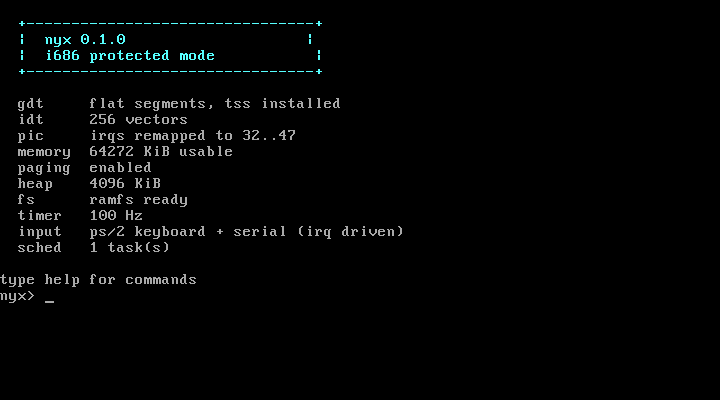

# nyx

A small operating system written from scratch for 32-bit x86. It boots from a
multiboot loader, sets up its own descriptor tables, manages physical and
virtual memory, preempts its own tasks, and drops you at a shell.

It is not a clone of anything. About 2,300 lines of C and assembly, no libc,
no third-party code, no runtime dependencies.

## running it on Windows

Download **nyx.exe** from the
[latest release](https://github.com/blavese/nyx/releases/latest) and run it.
The kernel is inside that file; nothing needs to be built.

The launcher checks for QEMU, the emulator nyx boots on, and offers to install
it from Microsoft's package manager if it is missing. Then press Start and a
black window opens with the operating system running in it. Type `guide` when
you get there.

It runs as a normal user, needs no administrator rights, and cannot affect
Windows: the kernel only ever sees the pretend machine QEMU gives it.

## running it from source

You need QEMU and Zig. Zig is used only as a cross compiler, so there is no
i686-elf toolchain to build first.

    ./run.sh          boot in a window
    ./run.sh -t       boot headless, console on stdout
    ./run.sh -T       run the built-in self test, exit code is the result

Try: guide, help, ls, cat readme.txt, ps, mem, spawn, uptime.

The Windows launcher lives in `launcher/` and is built with
`dotnet publish -c Release -r win-x64 --self-contained true -p:PublishSingleFile=true`.
It embeds `build/nyx.elf`, so build the kernel first.

## what it actually does

**Boot.** A multiboot header gets it loaded at 1 MiB in 32-bit protected mode.
The bootloader's memory map is read to find out how much RAM exists.

**Descriptor tables.** A flat GDT (kernel and user code/data) plus a TSS so a
future ring 3 can find its way back to a kernel stack. A 256-entry IDT with
stubs for all 32 CPU exceptions and 16 hardware IRQs, generated rather than
hand-written.

**Interrupts.** The 8259 PICs are remapped off the exception vectors to 32..47.
Exceptions that nothing handles print a register dump and halt, instead of
silently triple faulting.

**Physical memory.** A bitmap allocator, one bit per 4 KiB frame, built from
the firmware memory map. The kernel image and the bitmap itself are marked in
use so they can never be handed out.

**Virtual memory.** Two-level paging. The low 16 MiB is identity mapped so that
enabling paging does not move the ground out from under the kernel, and
map_page / unmap_page / virt_to_phys work for anything above that. Page faults
report the faulting address and whether it was a read or a write.

**Heap.** First-fit free list with boundary tags, coalescing neighbours on
free. kmalloc, kcalloc, kfree.

**Tasks.** Round-robin preemptive multitasking. Each task owns a kernel stack
holding a complete interrupt frame, so switching is a matter of telling the
interrupt return path to unwind a different one. Tasks sleep, yield and exit,
and dead ones are reaped.

**Drivers.** VGA text console with scrolling and colour, PS/2 keyboard with
shift/caps/ctrl, PIT at 100 Hz, and a 16550 serial port driven by IRQ4.

**Filesystem.** Flat and in memory. Files live on the kernel heap and do not
survive a reboot, because there is no disk driver yet.

**Shell.** Reads from the keyboard or the serial line, whichever produces a
character first, so a person can type at it and a script can pipe into it.

## testing

The kernel tests itself. `./run.sh -T` boots with selftest on the command line,
runs 31 checks across every subsystem, then writes to QEMU's debug-exit port so
the host gets a real exit status.

    === nyx self test ===
    [string]           8 checks
    [physical memory]  4 checks
    [paging]           4 checks
    [heap]             5 checks
    [filesystem]       6 checks
    [timer]            2 checks
    [interrupts]       2 checks

    31 passed, 0 failed
    SELFTEST_PASS

`tools/shell_test.sh` is the other half. It boots the OS, types commands at the
shell over the serial line, and checks what comes back. All nine checks pass.

## things that went wrong

The interesting part of writing a kernel is that nothing catches you. Every one
of these presented as a machine that stopped, with no message.

**memset called itself.** At -O2 clang recognises the byte-fill loop inside
memset as a memset, and replaces the body with a call to memset. It recursed
until the stack was gone. -fno-builtin does not stop the loop idiom pass; the
fix was volatile pointers in the three byte movers.

**The compiler emitted SSE.** Zig's default x86 target has SSE2 on, so clang
used movd xmm0 for a 64-bit integer move. The CPU had never been told the FPU
exists, so the first one raised an invalid opcode fault, far from anything that
looked related. Fixed with -mcpu=i686, and tools/check_sse.py now fails the
build if an SSE opcode reaches an executable section.

**The TSS descriptor got an address where it wanted a length.** Passing
base + size - 1 instead of size - 1 as the limit made ltr fault, which triple
faulted the machine one instruction into gdt_init.

**One timer tick, then silence.** The PIC will not deliver another interrupt at
the same or lower priority until it is acknowledged. The end-of-interrupt write
was missing, so exactly one IRQ0 arrived and the kernel waited forever for the
second.

**Serial input arrived shredded.** Piping a command into the shell produced
"notes.txshell" instead of "notes.txt shell". Instrumenting both ends settled
it: for a 26 byte burst the kernel reported irqs=3 got=4 read=4 dropped=0. The
receive path had lost nothing, because it was never given the bytes. QEMU's
-serial stdio backend does not apply back pressure to a pipe. The kernel now
takes IRQ4 and buffers into a ring, and the harness types at human speed, which
the guest keeps up with exactly (irqs=104 got=104 read=104 dropped=0).

## what it does not do

Being explicit about the boundary, because "operating system" covers a very
large range:

- **No userspace.** Everything runs in ring 0. The GDT has ring 3 descriptors
  and the IDT has a syscall gate at 0x80 ready, but nothing crosses yet.
- **No disk.** No ATA or virtio driver, so the filesystem is RAM only.
- **No ELF loader**, so there are no separate programs, only kernel tasks.
- **Flat filesystem**, no directories.
- **32-bit only**, single processor, no SMP and no APIC.
- **No networking.**

It is a real kernel in that it boots on the bare machine and manages its own
hardware. It is not something you would run anything real on, and it is several
orders of magnitude away from Linux, which is roughly 30 million lines.

## layout

    boot/boot.S        multiboot header and entry point
    kernel/gdt.c       segments and the task state segment
    kernel/idt.c       interrupt descriptor table and dispatch
    kernel/isr.S       the 49 interrupt stubs (generated)
    kernel/pic.c       8259 remapping
    kernel/pmm.c       physical frame allocator
    kernel/paging.c    two-level paging
    kernel/heap.c      kmalloc
    kernel/sched.c     preemptive round-robin tasks
    kernel/vga.c       text console
    kernel/serial.c    16550 uart, interrupt driven
    kernel/keyboard.c  ps/2 keyboard
    kernel/timer.c     programmable interval timer
    kernel/fs.c        in-memory filesystem
    kernel/shell.c     the shell
    kernel/selftest.c  the boot-time test suite
    kernel/welcome.c   the first-run text and the guided tour
    kernel/divide.c    64-bit division helpers libgcc would normally provide
    tools/             build checks and the shell test harness
    launcher/          the Windows launcher (C#/WPF)

## license

MIT, see LICENSE.
